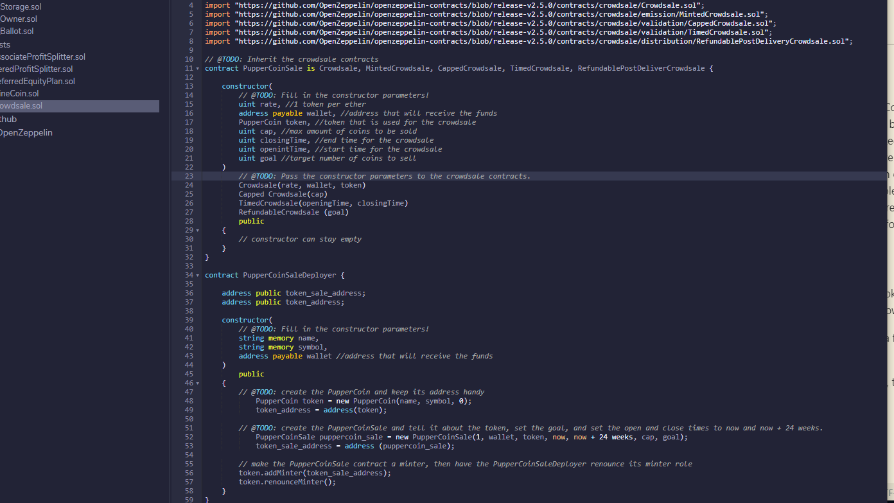

# advanced_solidity_hw

## Background
Your company has decided to crowdsale their PupperCoin token in order to help fund the network development.
This network will be used to track the dog breeding activity across the globe in a decentralized way, and allow humans to track the genetic trail of their pets. You have already worked with the necessary legal bodies and have the green light on creating a crowdsale open to the public. However, you are required to enable refunds if the crowdsale is successful and the goal is met, and you are only allowed to raise a maximum of 300 Ether. The crowdsale will run for 24 weeks.

## Instructions
First we will need to mint a standard ERC20Mintable token.   
Next we will be creating a contract that will act as a crowdsale for this coin. 

Using various OpenZeppelin contracts, we will create a full functioning contract after adding a few unique variables.

Lastly, we will test the contract on the Ropsten testnet, then store the contract. 

The final product should look like the following:
